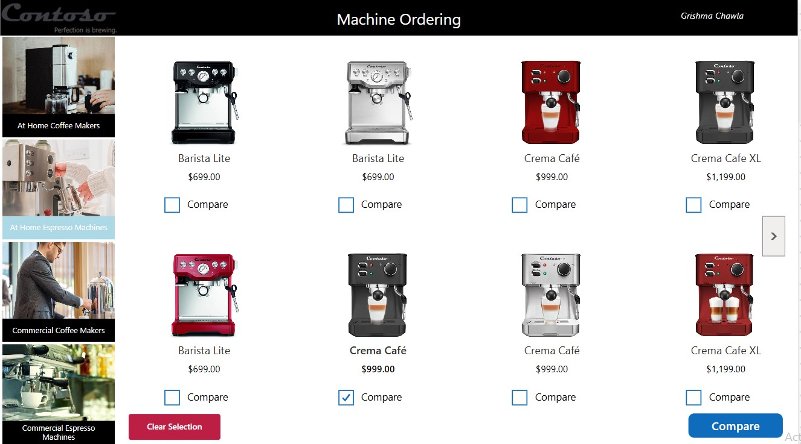
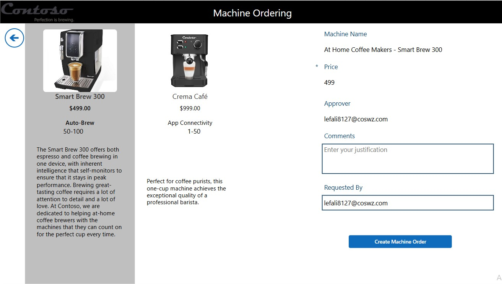
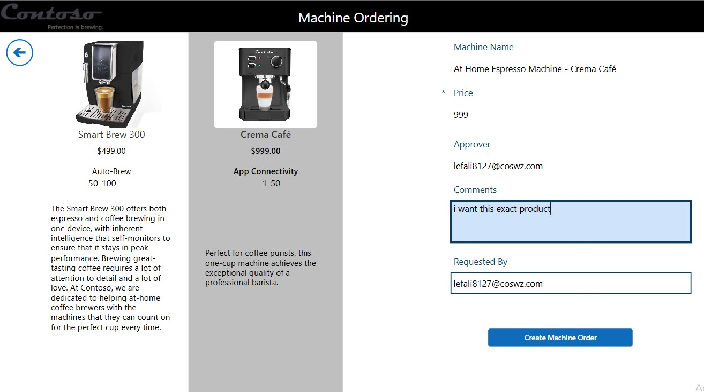
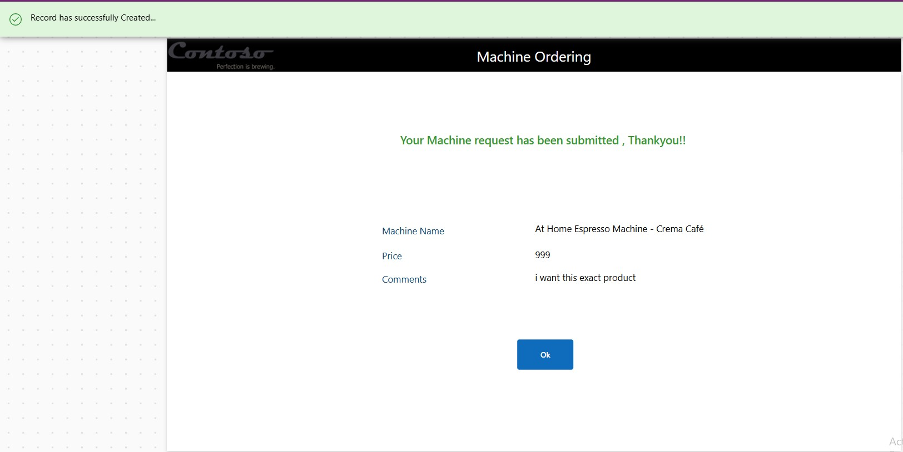
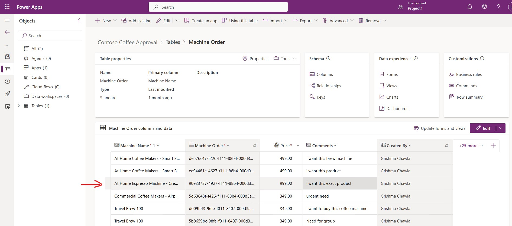
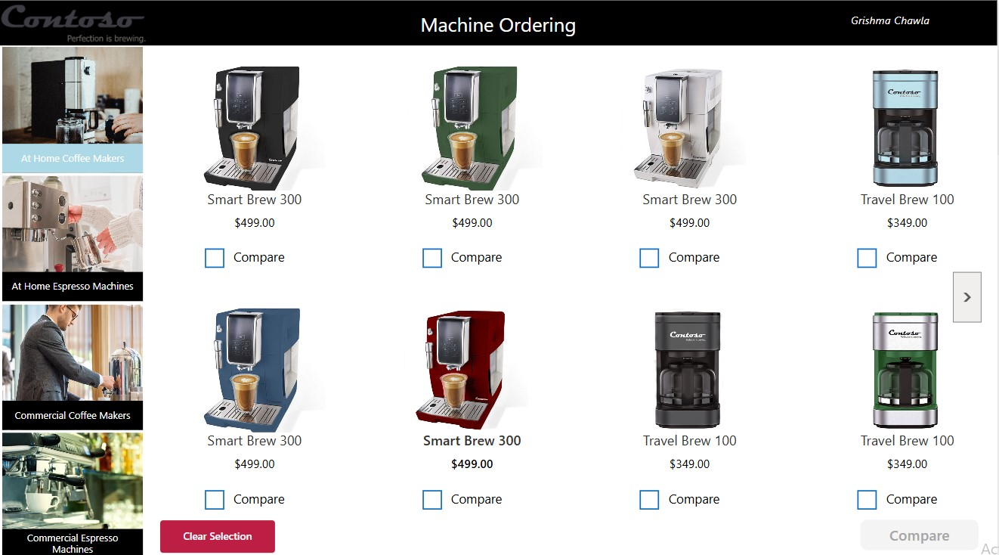

# Power Apps Canvas App - Contoso Coffee Machine Ordering

## Overview

This project is a **Canvas App built using Microsoft Power Apps** that enables users to browse and order coffee machines from the Contoso Coffee catalog. The app demonstrates real-world business scenarios including product comparison, approval workflows, and data management using Dataverse and Power Automate.

## Features

- Product catalog with multiple coffee machine categories
- Side-by-side comparison of machines
- Machine ordering with approval workflow
- Power Automate integration for automated approval requests
- Machine Procurement app for approvers (Model-driven app)
- Business Process Flow for order tracking
- Dataverse tables for storing machine and order data
- Responsive canvas app design

## Tech Stack

- Microsoft Power Apps (Canvas App)
- Microsoft Dataverse
- Power Automate (Cloud Flows)
- Model-driven App (Machine Procurement)
- Business Process Flow
- Microsoft Teams (Notifications)

## Screenshots













## Project Structure

```PowerApps-Contoso-Coffee-Machine-Ordering/

Solution/
  ContosoCoffeeApproval_1_0_0_1.zip

Screenshots/
  s1.jpg
  s2.jpg
  s3.jpg
  s4.jpg
  s5.jpg
  s.jpg

Docs/
  Importing Module 1.docx
  Importing Module 2.docx
  Importing Module 3.docx
  Complete Solution.docx
  README.md

.gitignore
README.md
```

## How to Use

1. **Download the solution file** from `Solution/ContosoCoffeeApproval_1_0_0_1.zip`
2. Go to the **Power Apps Maker Portal**
3. **Import the solution** using the Import option
4. Add necessary connections (Microsoft Teams, etc.) during import
5. **Publish All Customizations** after import
6. **Launch the Machine Ordering App**
7. Browse machines, compare, and submit an order
8. Check the **Machine Procurement App** for approval workflow

## Quick Start Commands (Git)

```bash
git clone https://github.com/grishmachawla/PowerApps-Contoso-Coffee-Machine-Ordering.git
cd PowerApps-Contoso-Coffee-Machine-Ordering
```

## App Components

- **Machine Ordering App** - Canvas app for browsing and ordering machines
- **Machine Procurement App** - Model-driven app for managing orders and approvals
- **Machine Order Table** - Dataverse table storing order records
- **New Machine Approval Request Flow** - Power Automate cloud flow for approvals
- **Business Process Flow** - Order lifecycle management

## Use Case

This application demonstrates an end-to-end **machine ordering and approval system** for a retail coffee company. It includes:

- Customer-facing product catalog and ordering system
- Automated approval workflow using Power Automate
- Management dashboard for order processing
- Integration with Microsoft Teams for notifications

## Author

Grishma Chawla

## If you like this project

Give it a * on GitHub!

## Learnings

- Canvas App development in Power Apps
- Dataverse table creation and relationships
- Power Automate cloud flows for business processes
- Model-driven apps for admin/procurement management
- Approval workflows with Power Automate
- Business Process Flow configuration
